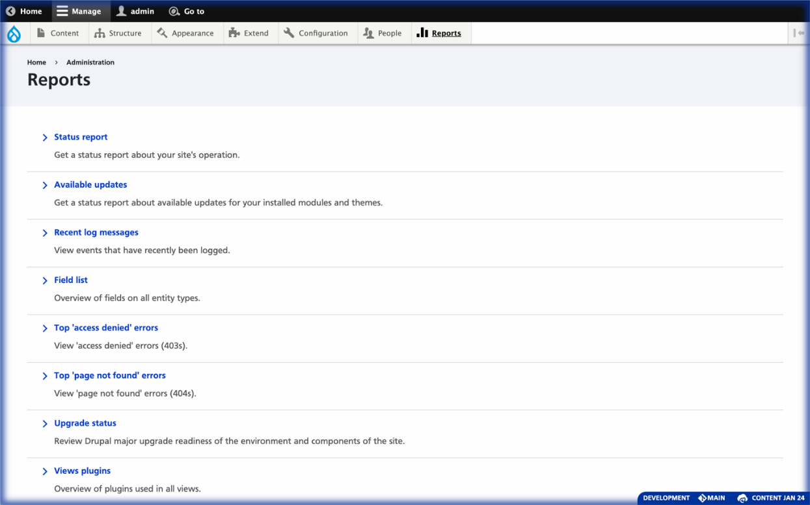

# Environment Indicator Loft UX, a Drupal Module



## Summary

This is an alternative UX by [In the Loft Studios](http://intheloftstudios.com) for the well known Drupal module [Environment Indicator](https://www.drupal.org/project/environment_indicator).

## Features

* Removes the color from the admin toolbar, and wraps the entire screen in a faint edge glow.
* Adds an informative label in the corner of the window.
* Provides the GIT branch in the description.
* Allows hiding the indicator by clicking or double clicking the label.
* Is highly customizable at the code-level.

## Requirements

1. [Environment Indicator Drupal module](https://www.drupal.org/project/environment_indicator)

## Install with Composer

1. Because this is an unpublished package, you must define it's repository in your project's _composer.json_ file. Add the following to _composer.json_ in the `repositories` array:

    ```json
    {
        "type": "github",
        "url": "https://github.com/aklump/drupal_environment_indicator_loft"
    }
    ```

2. Require this package:

    ```
    composer require aklump_drupal/environment_indicator_loft:^1.3
    ```

3. Add the installed directory to _.gitignore_

   ```php
   /web/modules/custom/environment_indicator_loft/
   ```

1. Enable this module

## Usage

### Hide with Single Click

The border can get in the way when doing front-end developing therefor it can be hidden easily. Single clicking the info panel, will hide the indicator until the next request.

### Hide for a Time with Double Click

Double clicking will hide it for all new requests for a length of time.

### Other Options

Other options for hiding can be selected at _/admin/config/development/environment-indicator_. You may pick various timeouts or you can negate an existing timeout by using the _Indicator display_ dropdown.

## Contributing

If you find this project useful... please consider [making a donation](https://www.paypal.com/cgi-bin/webscr?cmd=_s-xclick&hosted_button_id=4E5KZHDQCEUV8&item_name=Gratitude%20for%20aklump%2Fenvironment_indicator_loft).
