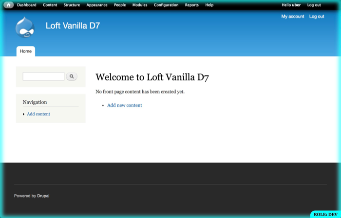

## Summary

This is an alternative UX by [In the Loft Studios](http://intheloftstudios.com) for the well known Drupal module [Environment Indicator](https://www.drupal.org/project/environment_indicator).  It removes the color from the admin toolbar, and wraps the entire screen in a faint edge glow.  It provides the GIT branch in the description.  It allows hiding the indicator by clicking or double clicking the title/description area.

**Visit <https://aklump.github.io/environment_indicator_loft> for full documentation.**

## Quick Start

1. Configure Environment Indicator as per that module's instructions.
1. Setup the correct permissions.
1. An example configuration is to add something like this to _settings.php_; the constants must be defined previously in some fashion for this example to work.

          switch (DRUPAL_ENV) {
            case DRUPAL_ENV_DEV:
              $config['environment_indicator.indicator']['bg_color'] = '#0ff';
              $config['environment_indicator.indicator']['fg_color'] = '#000';
              $config['environment_indicator.indicator']['name'] = 'Development';
              break;
        
            case DRUPAL_ENV_STAGING:
              $config['environment_indicator.indicator']['bg_color'] = '#0f0';
              $config['environment_indicator.indicator']['fg_color'] = '#000';
              $config['environment_indicator.indicator']['name'] = 'Test';
              break;
        
          }
          
1. Download this module to _web/modules/custom/_.
1. Enable this module and the UX of the module will change.
1. `drush en environement_indicator_loft`

## Requirements

* [Environment Indicator Drupal module](https://www.drupal.org/project/environment_indicator)

## Contributing

If you find this project useful... please consider [making a donation](https://www.paypal.com/cgi-bin/webscr?cmd=_s-xclick&hosted_button_id=4E5KZHDQCEUV8&item_name=Gratitude%20for%20aklump%2Fenvironment_indicator_loft).

## Usage

* Single click the title in the bottom right hand and the indicator will be hidden for that request.
* Double click the title and a cookie will be set for 30 minutes to hide the indicator.  You can use this if you are doing some critical theming and you do not want the visual interference of the border for a time.
* Hold down META while clicking to access the switcher (@todo This has not been built yet.)

## For a Demonstration Website

You can use something like the following for demo websites:

        <?php
        $config['environment_indicator.indicator']['bg_color'] = '#ff7f00';
        $config['environment_indicator.indicator']['fg_color'] = '#000';
        
        // Let our demo users know their data is not persistent.
        $config['environment_indicator.indicator']['name'] = 'Demonstration Website: Your Data May Be Deleted At Any Time';
        
        // Hide the GIT branch for our demo users, they don't care.
        $config['environment_indicator.indicator']['branch'] = '';
        
        // Autofade in this many seconds.
        $config['environment_indicator.indicator']['autofade'] = 3;
        
        // Set a cookie to hide for this many seconds after autofade; autofade must be > 0.
        $config['environment_indicator.indicator']['autocookie'] = 600;
