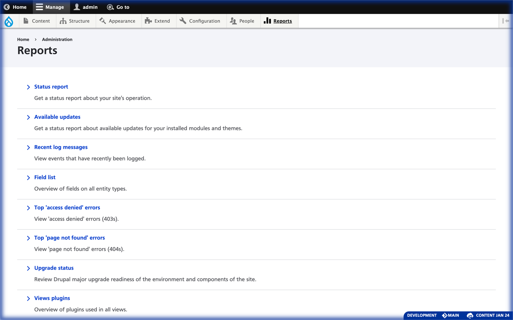

<!--
id: readme
tags: ''
-->

# Environment Indicator Loft UX, a Drupal Module

## Summary

This is an alternative UX by [In the Loft Studios](http://intheloftstudios.com) for the well-known Drupal module [Environment Indicator](https://www.drupal.org/project/environment_indicator).

## Features

* Removes the color from the admin toolbar, and wraps the entire screen in a faint edge glow.
* Adds an informative label in the corner of the window.
* Provides the GIT branch in the description.
* Allows hiding the indicator by clicking or double clicking the label.
* Is highly customizable at the code-level.

## Requirements

1. [Environment Indicator Drupal module](https://www.drupal.org/project/environment_indicator)

{{ composer.install|raw }}

1. Enable this module

## Usage

### Hide with Single Click

The border can get in the way when doing front-end developing therefor it can be hidden easily. Single clicking the info panel, will hide the indicator until the next request.

### Hide for a Time with Double Click

Double clicking will hide it for all new requests for a length of time.

### Other Options

Other options for hiding can be selected at _/admin/config/development/environment-indicator_. You may pick various timeouts or you can negate an existing timeout by using the _Indicator display_ dropdown.

{{ funding|raw }}

## Documentation

<svg width="48" height="48" viewBox="0 0 24 24" fill="none" xmlns="http://www.w3.org/2000/svg"><path fill="#fff" d="M0 0h24v24H0z"/><path d="M12 6.91c-1.1-1.401-2.796-2.801-6.999-2.904A.491.491 0 0 0 4.5 4.5v12.097c0 .276.225.493.501.502 4.203.137 5.899 2 6.999 3.401m0-13.59c1.1-1.401 2.796-2.801 6.999-2.904a.487.487 0 0 1 .501.489v12.101a.51.51 0 0 1-.501.503c-4.203.137-5.899 2-6.999 3.401m0-13.59V20.5" stroke="#000" stroke-linejoin="round"/><path d="M19.235 6H21.5a.5.5 0 0 1 .5.5v13.039c0 .405-.477.673-.846.51-.796-.354-2.122-.786-3.86-.786C14.353 19.263 12 21 12 21s-2.353-1.737-5.294-1.737c-1.738 0-3.064.432-3.86.785-.37.164-.846-.104-.846-.509V6.5a.5.5 0 0 1 .5-.5h2.265" stroke="#000" stroke-linejoin="round"/></svg>&nbsp;&nbsp;
[Read the online documentation](https://aklump.github.io/drupal_environment_indicator_loft/pages/general/readme.html) &rarr;

